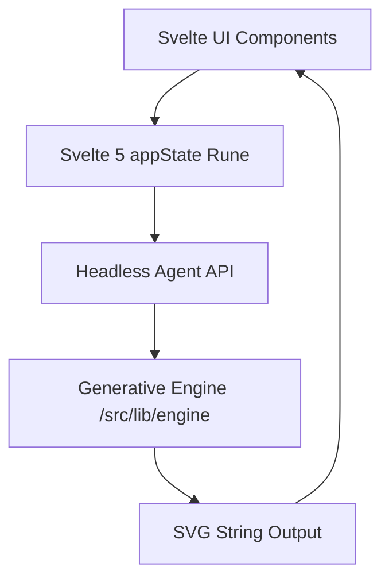

# SumoSized SVG Generator: Architecture Overview

The application follows a strict **Domain-Driven Design (DDD)** pattern, separating mathematical generative logic from Svelte reactivity and UI state.

## System Interaction Mapping

### 1. The Generative Engine (`src/lib/engine`)

The core "brain" of the project. It is 100% pure TypeScript and has zero dependencies on Svelte, the DOM, or any browser-specific APIs. It can be executed natively in Node.js or Cloudflare Workers.

### 2. appState (`src/lib/state`)

Uses Svelte 5 Runes (`$state`, `$derived`) to manage the layer stack, user presets, and active configuration. It acts as the bridge between the UI and the Engine.

### 3. Agent API (`src/lib/services/agentApi.ts`)

A headless wrapper that exposes internal state mutations to the global `window` object. This allows AI agents or external test runners to "skill up" and manipulate the canvas programmatically.

### 4. UI Components (`src/lib/ui`)

Pure presentational layers built with Svelte. They are optimized for INP (Interaction to Next Paint) by directly injecting the engine's stringified SVG output via `{@html}` blocks.

## 📹 Media Pipeline

The media pipeline handles the conversion of SVG compositions into professional video and image formats.

### 1. exportService.ts (The Orchestrator)

- **Role**: High-level API for all exports (Static & Video).
- **Function**: Handles frame capture timing, progress reporting, and selects the best encoder backend.
- **Location**: [exportService.ts](../src/lib/services/exportService.ts)

### 2. media/encoder.ts (The Abstraction)

- **Role**: Common interface for all encoding backends.
- **Function**: Feature-detects capabilities (WebCodecs vs FFmpeg) and exports the correct backend instance.
- **Location**: [encoder.ts](../src/lib/media/encoder.ts)

### 3. media/webcodecsEncoder.ts (Hardware Express)

- **Role**: Hardware-accelerated MP4/WebM/MOV encoding. Up to **50x faster** than WASM.
- **Location**: [webcodecsEncoder.ts](../src/lib/media/webcodecsEncoder.ts)

### 4. media/ffmpegEncoder.ts (The Legacy Fallback)

- **Role**: Software fallback for video encoding (h264/VP9) for environments without `VideoEncoder`.
- **Location**: [ffmpegEncoder.ts](../src/lib/media/ffmpegEncoder.ts)

## Module Dependency

The project is structured to prevent circular dependencies. The `engine` is at the bottom of the stack—it knows nothing of the UI. The `UI` is at the top—it consumes the `engine` and `state`.
