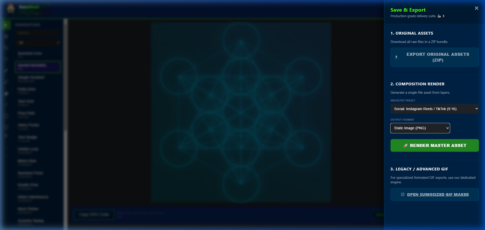

# Walkthrough: GIF Removal & Engine Cleanup

Mission accomplished. We have successfully pivoted from the unstable native WASM GIF export to a professional external pipeline. This simplifies the codebase, avoids browser memory hangs, and improves the focus on high-performance hardware-accelerated video.

## Key Changes

### 1. UI Refinement

- Removed the **Animated GIF** option from the output format dropdown in the Export Panel.
- Added a dedicated section for **Legacy / Advanced GIF** with a direct link to your professional [SumoSized GIF Maker](https://sumosizedginger.github.io/sumosized-gif-maker/).



### 2. Codebase Hardening

- **State Management**: Stripped `gif` types and logic from `appState.svelte.ts`.
- **FFmpeg Pipeline**: Removed the complex two-pass palette generation logic and the GIF-specific memory optimizations (pre-scaling). This makes the `ffmpegEncoder.ts` significantly leaner and more maintainable.
- **Unified Importer**: Cleaned up metadata and comments to remove legacy GIF references.

### 3. Documentation & Security

- Updated `README.md` to highlight the hardware-accelerated pipeline and the dedicated GIF tool.
- Refined `Download types.md` to show the final supported roster (PNG, JPEG, WebP, SVG, MOV, MP4, WebM).
- Updated internal architecture docs to reflect the decommissioned GIF engine.

## Verification Results

- **Build Status**: `npm run check` passed with **0 errors and 0 warnings**.
- **UI Verification**: Manually confirmed the dropdown and link behavior via browser subagent.
- **Global Audit**: Global search for `gif` (case-insensitive) confirms all execution paths are cleaned.

````carousel

<!-- slide -->
```typescript
// FFmpegEncoder now focused purely on video fallback
supports(format: string): boolean {
    return ["mov", "mp4", "webm"].includes(format);
}
```
````

No code has been pushed to GitHub. The mission is internally complete. 🦾⚡🇺🇸
